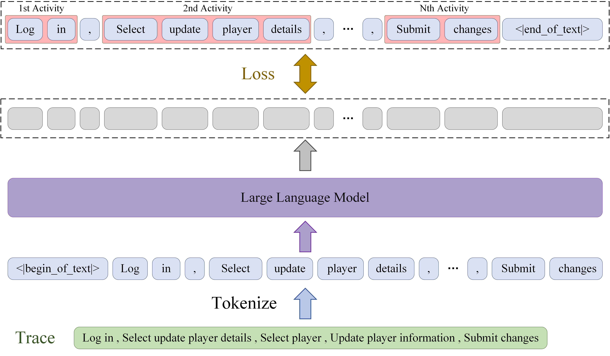

# SemAD: LLM-Based Semantic Anomaly Detection Framework for Business Processes

Identifying and addressing anomalies in business processes is critical for maintaining operational stability. Although
existing methods often detect anomalies through statistical analysis of frequency, infrequent behaviors do not
necessarily indicate anomalies. Consequently, detecting anomalies from a semantic perspective has become a research
focus. This paper proposes a semantic anomaly detection method for business processes based on large language models,
called SemAD. Specifically, it fine-tunes a large language model to reconstruct normal traces and detect anomalies based
on reconstruction errors. This paper designs a novel token anomaly score calculation method. Since each executed
activity (event) is tokenized into multiple tokens, the anomaly score of an event is aggregated from the anomaly scores
of all its constituent tokens.Experiments demonstrate that SemAD surpasses existing state-of-the-art semantic anomaly
detection methods in both generalization ability and learning of given processes.


## Using Our Code to Reproduce the Results

1. Create conda environment.

```
 conda install --yes --file requirements.txt # You may need to downgrade the torch using pip to match the CUDA version
```


2. Download open-source LLM [Meta-Llama-3-8B](https://hf-mirror.com/meta-llama/Meta-Llama-3-8B/tree/main), and
   save it to the root directory

```
   ├── Meta-Llama-3-8B
   │ ├── config.json
   │ ├── configuration.json
   │ ├── generation_config.json
   │ ├── LICENSE
   │ ├── model-00001-of-00004.safetensors
   │ ├── model-00002-of-00004.safetensors
   │ ├── model-00003-of-00004.safetensors
   │ ├── model-00004-of-00004.safetensors
   │ ├── model.safetensors.index.json
   │ ├── special_tokens_map.json
   │ ├── tokenizer.json
   │ └── tokenizer_config.json
```

3. (Optional) Fine-tune Llama3. This step can be **skipped** by directly using our fine-tuned model (llama-13b-int4-dolly_N)

- In 'fine-tune-Llama3.py', config 'llm_path' as the path of open-source LLM 'Meta-Llama-3-8B'  and 'data_path' as the path of training data.
- Run ```python fine-tune-Llama3.py``` from the root directory to get fine-tuned model (${ft_model_name}/llama-13b-int4-dolly_*)

4. Evaluate on test dataset.

- In 'eval.py', config 'llm_path' as the path of open-source LLM 'Meta-Llama-3-8B', 'data_path' as the path of data for testing 
 and 'peft_path' as the path of the trained peft model.
- Run ```python eval.py``` from the root directory.